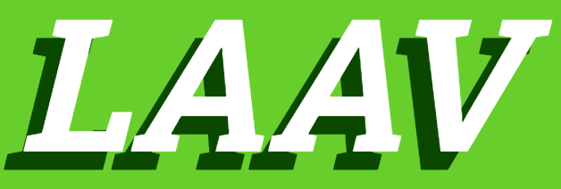

# Bem Vindo ao LAAV

</img>


## Requesitos :

### PHP ^8.1 

Disponivel em <a href="https://www.php.net/downloads.php">https://www.php.net/downloads.php</a>


#### Extensões
php-curl <br>
php-mbstring <br>
php-pdo_mysql <br>
php-gd


### Composer 2.6.3

Disponivel em <a href="https://getcomposer.org/download/">https://getcomposer.org/download/</a>


### Mysql 8.0.34

Disponivel em <a href="https://dev.mysql.com/downloads/installer/">https://dev.mysql.com/downloads/installer/</a>


### Node.js 18.18.0

Disponivel em <a href="https://nodejs.org/en">https://nodejs.org/en</a>


## Guia de instalação

### Instalando as dependências do projeto
```shell
composer install 

```
### Gerando o env do projeto
```shell
cp .env.example .env

```
### Configurando a chave da aplicação
```shell
php artisan key:generate 

```
### Configurando o banco de dados da aplicação
```shell
php artisan migrate

```
### Configurando o front-end da aplicação
#### Instalando os pacotes nodejs
```shell
npm install
```
#### Compilando os assets do front end
```shell
npm run build
```


