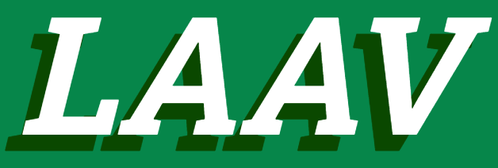

# Bem Vindo ao LAAV

</img>


## Requesitos :

### XAMPP 8.2.12 

Disponivel em <a href="https://www.apachefriends.org/download.html">https://www.apachefriends.org/download.html</a>


### Composer 2.6.3

Disponivel em <a href="https://getcomposer.org/download/">https://getcomposer.org/download/</a>


### Node.js 22.12.0

Disponivel em <a href="https://nodejs.org/pt">https://nodejs.org/pt</a>


## Guia de instalação

### Instalando as dependências do projeto
```shell
composer install 

```
### Gerando o env do projeto
```shell
cp .env.example .env

```
### Configurando a chave da aplicação
```shell
php artisan key:generate 

```
### Configurando o banco de dados da aplicação
```shell
php artisan migrate

```
### Configurando o front-end da aplicação
s
#### Instalando os pacotes nodejs
```shell
npm install
```
#### Compilando os assets do front end
```shell
npm run build
```


